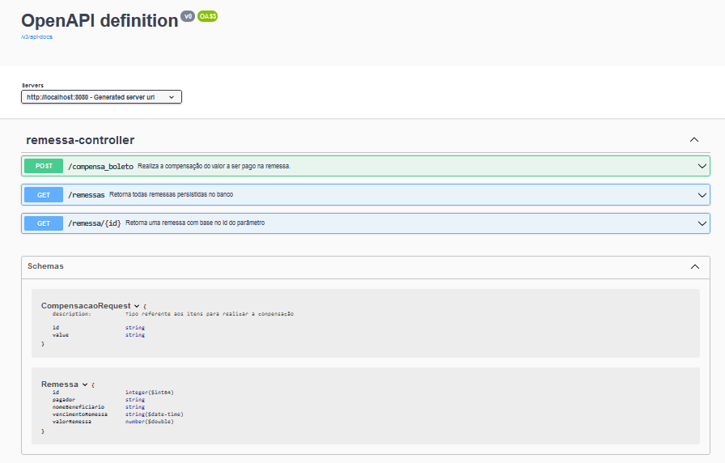

# BoletoReadWriteProject

Projeto desenvolvido na disciplina de integração de sistemas.

Com o ojetivo de praticar diferentes técnicas de integração entre sistemas, nesse projeto serão usados:

<b>[hot folder](https://www.ibm.com/docs/en/ahts/4.0?topic=folders-setting-up-hot)</b> para que uma aplicação Java possa fazer a escrita de arquivos como remessa de cobrança bancária no layout CNAB240 para Caixa Economica Federal, outra aplicação em Node fará a leitura do arquivo no hot folder.

<b>[API Rest](https://www.redhat.com/pt-br/topics/api/what-is-a-rest-api)</b> documentada nos padrões da OpenAPI, para que seja possível gerar uma interface de consumo dos serviços da API, que deverá processar o pagamento caso o valor enviado seja exatamente o valor da dívida do cliente.

## Tecnologias

  * Java
  * Node
  * Docker
  * Manipulação de arquivos com a técnica hot folder
  * API rest com especificação Open API
  * Diversas bibliotecas

## Uso da escrita e leitura no hotFolder

  - Inicialize o docker;
  - Execute [runEscrita.bat](runEscrita.bat);
  - Execute [runLeitura.bat](runLeitura.bat).

  Alternativamente:
  - Inicialize o docker;
  - Execute o comando "docker compose up --build" no diretório raiz do projeto;
  - Execute a aplicação [XLSMtoPostgresDB](/XLSMtoPostgresDB/app/src/main/java/XLSMtoPostgresDB/App.java) para persistir os dados de escrita na base de dados postgres;
  - Execute a aplicação [BoletoWriterJAVA](/boletoWriterJAVA/app/src/main/java/boletoWriterJAVA/App.java) para obter os registros da base de dados como remessas cnab240 no [hotFolder](hotFolder);
  - Acesse a aplicação rest em localhost:8080; veja seus enpoints abaixo.
  
  É necessário seguir todos os passos para conseguir o resultado desejado, já que diferentes aplicações estarão atuando em conjunto para efetuar ações como persistência de dados, leitura e escrita.

## Uso da API rest

Após subir a aplicação, é possível visualizar a interface de uso da api via especificação OpenAPI ou Swagger-ui nas seguintes URLs:

OpenAPI: http://localhost:8080/v3/api-docs
Swagger-ui: http://localhost:8080/swagger-ui/index.html

### Enpoints da API

